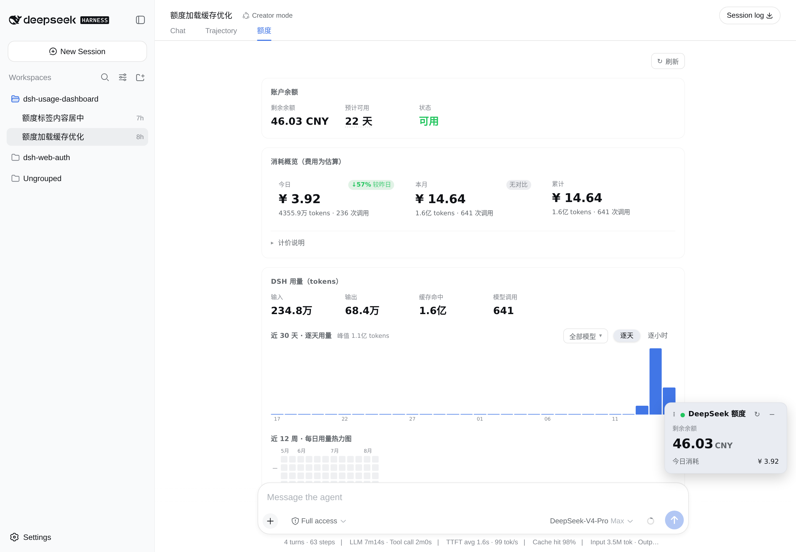
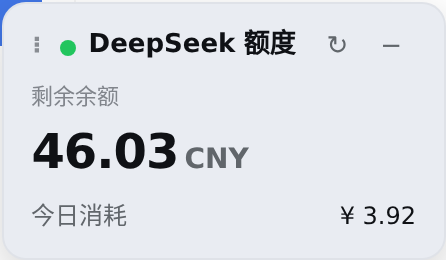
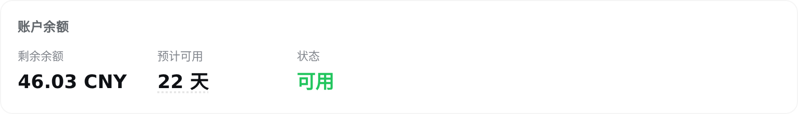
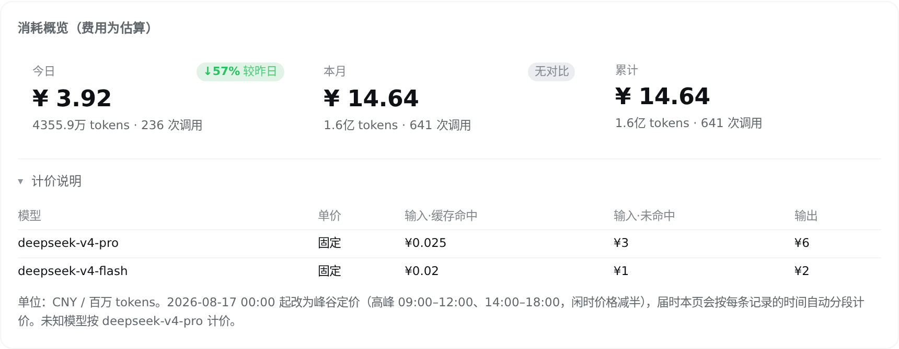
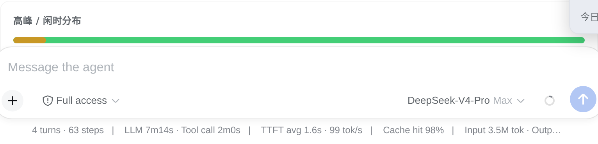
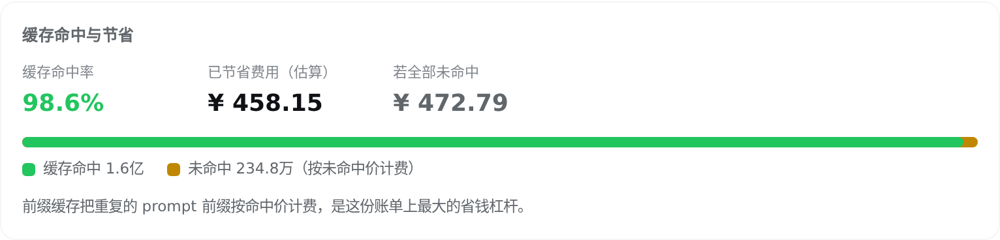
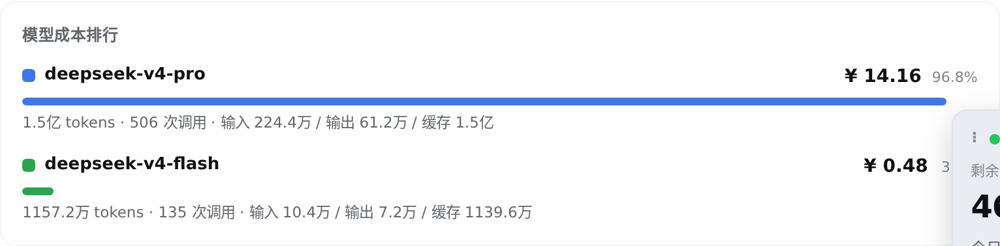
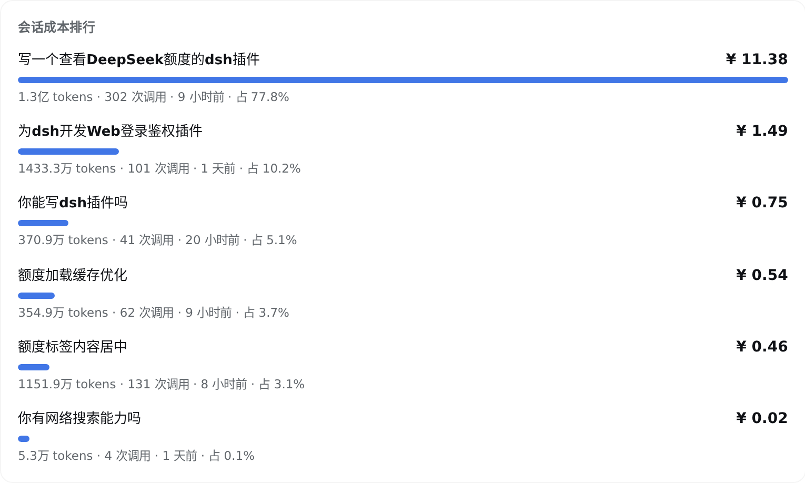
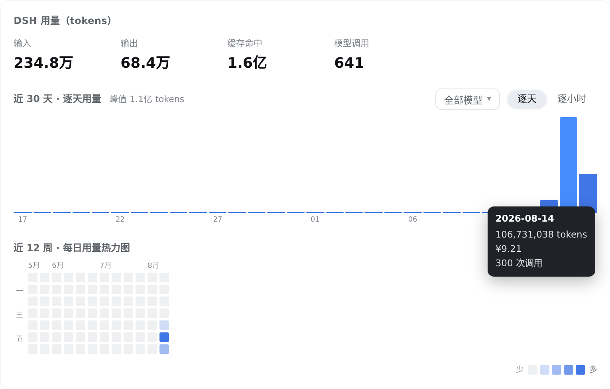
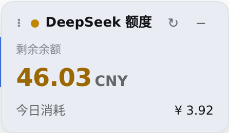

# dsh-usage-dashboard

[](https://www.npmjs.com/package/@cassius0924/dsh-usage-dashboard)
[](./LICENSE)
[](https://github.com/Cassius0924/dsh-usage-dashboard)

> **This is a fork of [Cassius0924/dsh-usage-dashboard](https://github.com/Cassius0924/dsh-usage-dashboard)
> licensed under the **MIT License**. The original copyright notice is preserved in
> [LICENSE](./LICENSE) (`Copyright (c) 2026 Cassius0924`). Modifications by
> [@VincentPhoton](https://github.com/VincentPhoton) are listed at the bottom of this file.**

在 [DSH](https://github.com/deepseek-ai)（DeepSeek Harness）的 Web GUI 里，随时看得见 DeepSeek 的钱花在哪：
**余额还能撑几天、今天花了多少、哪个模型最贵、缓存替你省了多少、钱里有多少来自图片**，以及峰谷定价生效后把任务挪到闲时能省多少。

---

## ⚠️ 关于"今日消耗 / 当前会话消耗"显示值的计费说明（必读）

> **重要提示：以账户实际扣款余额为准，本组件显示的金额字段仅供参考。**

本插件内置的费率表**仅覆盖 DeepSeek 官方模型**（deepseek-chat、deepseek-reasoner、deepseek-coder 等），
按 DeepSeek 公开 API 价格（输入/输出 token 单价 + 缓存命中价 + 峰谷时段）做估算。

**当当前会话或今日聚合中包含以下模型时，金额字段会失真：**

| 模型类别 | 示例 | 实际行为 |
|---|---|---|
| DeepSeek 官方模型 | deepseek-chat, deepseek-reasoner | ✅ 按 DeepSeek 官方价**准确**计算 |
| 其他厂商模型 | qwen2.5-coder、qwen3、Claude、GPT-4o、本地 oMLX 等 | ⚠️ **按 DeepSeek 官方价估算，非实际扣款** |
| 本地 / 私有模型 | Ollama / oMLX / LM Studio 跑的任何模型 | ⚠️ **按 DeepSeek 官方价估算，但实际无扣款** |

### 含义与建议

1. **本地推理无扣款**：用 oMLX / Ollama 跑本地模型时，DeepSeek 账户**不会**扣任何费用，
   实际余额不变。但本组件会按 DeepSeek 官方价显示一个虚拟消耗数字。
2. **第三方模型费率差异**：用 qwen / Claude / GPT 等时，**这些模型有自己的计费体系**，
   与 DeepSeek 不同；本组件无法识别它们的实际单价。
3. **余额是唯一真相源**：要确认真实扣款，请看
   [DeepSeek Platform Usage](https://platform.deepseek.com/usage) 的账户余额变化，
   或 `GET /user/balance` 接口返回的 `currentBalance` 字段。
4. **今日消耗（平台核算）**：此卡片按 `GET /user/balance` 的**余额差值法**核算，
   **真实反映 DeepSeek 账户的扣款**。当其他模型与 DeepSeek 混用时，此卡片仍准确
   （只看余额差），与上述 token 估算卡片互补——以它为准。
5. **峰谷时段**：仅 DeepSeek 模型适用，闲时半价规则对其他厂商模型无意义。

---



装上之后 GUI 里多两样东西：右下角一个可拖动的**悬浮额度窗**，顶部栏多一个**「额度」tab**。
界面支持中文与 English，直接跟随 DSH 全局的「Settings → Language」设置；切换无需刷新，选择由 DSH 持久化。

---

## 为什么需要它

用 DSH 跑 agent，钱是一点一点漏掉的，而 DSH 自己不会告诉你：

| 你真正想知道的 | 装之前 |
|---|---|
| 余额还能用几天？ | 只有一个余额数字 |
| 今天花了多少？这个月呢？ | 只有「累计」，没有时间感 |
| 钱花在哪个模型上？ | 不知道 |
| 缓存到底帮我省了多少？ | 完全看不到 |
| 钱里有多少来自图片？ | 多模态模型上线后更是看不见 |
| 高峰时段多付了多少？ | 只能自己算 |

这个插件把这些问题逐个翻译成一眼能看懂的数字。**费用全部为估算**，算法与单价公开可查（见[费用是怎么算的](#费用是怎么算的)）。

---

## 悬浮额度窗



常驻右下角，不打断你干活：

- 余额 + **今日消耗**，一眼就够。
- 可拖动，松手自动吸附四角；边界避开侧边栏、右侧详情面板、会话顶栏和输入框——**不会挡住发送按钮**。
- 可收起成一行；**显示/隐藏、所在角落、收起状态都会记住**，刷新页面后原样回来。
- 余额跌破预警线时，状态点和余额数字一起转成警示色。
- 60 秒自动刷新余额。今日消耗读共享缓存，点 ↻ 同时刷新两者。
- 插件加载时就把余额和用量预取到缓存里，所以打开「额度」tab 通常是秒开，
  不用等那几秒的会话日志重放；预取失败不报错，交给各自挂载时再取。

## 「额度」仪表盘

### 余额：还能撑几天



「还剩多少钱」不解决余额焦虑，「还能用几天」才行。按近 7 个自然日（含没用的日子）的日均消耗折算，hover 能看到估算口径；不足 3 天转红。

### 今日 / 本月花了多少 —— 以及这个数怎么来的



今日、本月、累计三个窗口，今日带「较昨日」、本月带「较上月同期」环比（**上月同期**而不是上月整月，免得月初总是显得便宜）。

展开**计价说明**能看到费用估算实际套用的单价表——估算不该是个黑箱。

### 高峰时段多付了多少



DeepSeek 从 2026-08-17 00:00 起改峰谷定价，高峰（北京时间**工作日** 09:00–12:00、14:00–18:00）的 input/output 价格是闲时的两倍（缓存命中价不变）；整个周末和法定节假日都是闲时。

这张卡告诉你用量落在峰谷两侧的比例，以及**如果高峰用量都挪到闲时能省多少**——批量、可延后的任务放到闲时跑，同样的 token 只要一半的钱。

### 缓存替你省了多少



前缀缓存的命中价只有未命中价的百分之一量级，是 DSH 这类高重复 prompt 负载上**最大的省钱杠杆**——上图这份用量实付 ¥14.64，缓存省下了 ¥458.15。

命中率掉到 60% 以下时，文案会换成怎么把它救回来的建议。

### 钱里有多少来自图片

> 截图待补拍：当前机器没有真实图片用量时，卡片显示的是空态，以下先以文字说明功能。

`deepseek-v4-flash-vision-exp` 上线后，图片按尺寸折算成 token 与文本一并计费，但「看了一堆截图」和「纯文本」在账单里长得一模一样。

这张卡重放会话日志时顺手数出图片：用户消息里的附件和 tool result 里的截图都会统计（不用读附件本体，日志里就有宽高）。每组数字给出**图片张数、按官方换算规则估算的 token 与费用，以及占窗口输入 / 费用的比例**，旁边是每天图片数的趋势和「图片最多的会话」排行——一个不停刷截图的循环会话，在这里一眼就能认出来。

图片归属到随后一次模型调用，按该调用的时段与模型单价估算；实际 token 数以接口返回的用量为准。

### 钱花在哪个模型上



按费用降序，带占比条和输入/输出/缓存拆分。模型配色在排行、下拉选择器和图表图例三处一致。

### 哪个会话最烧钱



按模型、按天的视图告诉你「花在什么上」和「什么时候花的」；这张告诉你**是哪一次跑掉的**——对 agent 用户来说，这是唯一能直接动手改的东西：一个特别贵的会话，通常意味着一段值得看看的 prompt 或一个没收住的循环。上图里一个会话就占了总花费的 77.8%。

会话标题直接从会话日志里读（`session/title` 事件），跟用量重放搭同一趟车，不额外读盘。

### 用量的时间分布



近 30 天逐天、0–23 点逐小时（可按模型多选过滤，叠成分组柱状图），外加近 12 周热力图。hover 立刻出 tooltip，不用等系统那一秒。

### 余额预警


在「设置」里定一条预警线（默认 ¥10，填 0 关闭）。跌破时仪表盘顶部出现警示条——带上还能撑几天和充值入口——同时悬浮窗一起转警示色，两边不会各说各话：



---

## 安装

标准 DSH 插件包（bundle + client 双面包），用 `dsh plugin` 装：

```sh
# 从 npm 安装
dsh plugin --profile web add @cassius0924/dsh-usage-dashboard

# 或从 GitHub（git 依赖会跑 prepare 脚本现场构建）
dsh plugin --profile web add github:Cassius0924/dsh-usage-dashboard

# 或本地 checkout
dsh plugin --profile web add ./path/to/dsh-usage-dashboard
```

然后**重启 dsh**（`dsh --profile web`）生效。

前提：

- 已配置 `DEEPSEEK_API_KEY`（「设置 → 模型」里填，或放在 `$DSH_HOME/.credentials.yaml`）——余额接口要用。
- 本机有 pnpm（`dsh plugin` 是 pnpm 的转发器）。

装好后打开 GUI，**进入任意一个会话**（「额度」tab 挂在 `conversation.view` 上，New Session 首页没有 tab 栏），顶部就能看到 `Chat / Trajectory / 额度`。

> 兼容性：同时支持两代宿主接口——旧版 `readFrom(id, 0)` 与新版 handle 化 `open(id, 'read')` / `read` / `close`。
> 宿主升级到移除 `readFrom` 的版本后，插件无需更换版本，会话日志照常重放。

## 费用是怎么算的

费用是**估算**，不是账单。规则都在 [`src/pricing.ts`](src/pricing.ts) 一个文件里：

- 逐条用量记录按「**模型** + **是否落在高峰时段** + **当时的价目表**」计价，而不是全局一套价。
- 2026-08-17 00:00（北京时间）之前按旧的固定价；之后按峰谷价。**2026-09-10 12:00 起空闲时段价格 = 高峰时段价格的一半（含缓存命中价）**，与[官方价格页](https://api-docs.deepseek.com/zh-cn/quick_start/pricing/)逐行一致；08-17–09-10 这一段历史用量保留本 fork 当时按实际账单核对出的口径（仅 input/output 半价，缓存命中价不减半）。
- 2026-09-10 12:00 起 Flash 系列降价（V4.1-Flash）；2026-09-14 12:00 起 `deepseek-v4-pro` 的请求由 V4.1-Flash 承接，按 Flash 价计费。
- 高峰时段按**北京时间**判定，不随机器时区漂移；且**仅限工作日**——周六、周日和法定节假日全天都是闲时（法定节假日表在 [`src/pricing.ts`](src/pricing.ts) 的 `CN_HOLIDAYS`，国务院每年公布后需补充新年度）。
- 用量按 messageId 跨会话去重（子代理会话会回放父会话的同一批事件，不去重会重复计数）。
- 未识别的模型按 `deepseek-v4-pro`（较贵的一侧）计价。

单价（CNY / 百万 tokens，与官方价目表的两档一致）：

| 模型 | 时段 | 输入·缓存命中 | 输入·未命中 | 输出 |
|---|---|---|---|---|
| deepseek-flash | 高峰 / 闲时 | 0.04 / 0.02 | 2 / 1 | 8 / 4 |
| deepseek-v4-pro | 高峰 / 闲时 | 0.3 / 0.15 | 9 / 4.5 | 27 / 13.5 |

`deepseek-v4-flash`、`deepseek-v4-flash-vision-exp` 是旧模型名，现由 `deepseek-flash` 承接、按 Flash 价计费；2026-09-14 12:00 起 `deepseek-v4-pro` 的请求也路由到 V4.1-Flash，按 Flash 价计费。历史各时期单价：08-17 前 pro 0.025/3/6、flash 0.02/1/2；08-17 – 09-10 12:00 的 flash 高峰 0.1/3/9、闲时 0.1/1.5/4.5（该段是本 fork 按实际账单核对出的口径；官方该期闲时表为 0.05/1.5/4.5）。

图片不另外收费，而是按尺寸折算成 token 与文本一并计费：官方规则是先把图片按比例缩放到 ~800×800（小于 ~384×384 的放大），token 与缩放后面积成正比、每张上限 384 tokens。多模态卡的估算就套这条规则。

DeepSeek 再调价时，只改这张表。

## 开发 / 构建

```sh
pnpm install
pnpm test           # Node 内置测试运行器：计价、缓存、信任围栏与用量聚合
pnpm run build      # esbuild 出 lib/index.js（host）+ lib/client.js（client），再 tsc 出类型
pnpm run typecheck
```

产物：

- `lib/index.js` —— Host 半（ESM，Node），注册 `/api/dsh-usage-dashboard/*` 路由。
- `lib/client.js` —— Client 半（CJS 闭包），通过 `window.__ModuleLoader__` 注册进 web 启动图。

改动生效方式不同：只改 `src/client/**` 时，浏览器硬刷新（Ctrl/Cmd+Shift+R）即可；改了 `src/index.ts` 等 host 端要重启 dsh。

```
src/
├── index.ts        # Host 半入口（webServer 路由 + TTL 记忆化）
├── usage.ts        # 余额 + 用量聚合（按天/小时/模型/峰谷分桶）
├── pricing.ts      # 价目表与费用估算（唯一改价的地方）
├── contract.ts     # host ↔ client 的 wire 类型
├── trust-fence.ts  # 浏览器信任校验
└── client/
    ├── index.tsx   # Client 半入口（slots 注册）
    ├── widget.tsx  # 悬浮额度窗
    ├── dashboard.tsx # 「额度」tab
    ├── charts.tsx  # 柱状图 / 热力图 / tooltip
    ├── locales.ts  # 中英文完整词典
    ├── i18n.tsx    # DSH locale 桥接与翻译上下文
    ├── styles.ts   # 全部样式
    ├── api.ts      # fetch + 客户端缓存
    ├── cache.ts    # TTL 缓存（含 localStorage 持久化）
    ├── prefs.ts    # 用户设置持久化
    └── store.ts    # 两个界面共享的设置
```

样式全部走 DSH 自己的 `--dsw-alias-*` CSS 变量，跟随宿主主题，不引入独立配色。

## 已知限制

- 用量数据来自**本机** DSH 会话日志，不含其它机器/账户的用量。
- 费用是估算：不含 DeepSeek 侧的折扣、赠金消耗顺序等因素，以官方账单为准。
- 图片 token 按官方换算规则估算，且把图片归属到随后一次模型调用；若缺少图片宽高或图片后没有成功的调用，则不纳入估算（无调用即无计费）。
- 首次加载用量需要重放全部会话日志（本机实测约 5 秒），因此有 5 分钟的服务端记忆化；界面在此期间显示骨架屏。

## License

[MIT](./LICENSE) — Copyright (c) 2026 Cassius0924. See [LICENSE](./LICENSE) for the full text.

---

## Modifications by [@VincentPhoton](https://github.com/VincentPhoton)

This fork includes the following changes on top of upstream `c94632e`
(`Add screenshots.json for dsh-market storefront`):

### 🐛 Fixes

- **`fix: 跨会话按 messageId 去重 + 缓存命中价不参与闲时半价`** —
  今日调用数从虚高约 3.7× 降到真实（与平台口径偏差 ~2%）；
  今日费用从低估 27% 修正到偏差 ≤5%。
- **`fix: 高峰时段仅限工作日，周末与法定节假日整天空闲`** —
  新增 2024/2025/2026 三年中国法定节假日表（28+28+14 个日期）。
- **`fix(balance): 跨天「今日消耗」自动重置`** —
  缓存加 `sameDayOnly` + `beijingDayKey` 跨天约束；`credentials.resolve` 加 10s 有界超时。
- **`fix(ui): 额度标签打开时滚回顶部 + 白屏轻推`** —
  修复宿主 `[data-conversation-scroll]` 共享容器导致的滚到设置区 + 偶发白屏。
- **`fix(api): getCachedBalanceAt 补充缓存拉取时刻取值`** —
  修正 `balanceAt` 类型，typecheck 通过。

### ✨ Features

- **`feat: 余额卡新增「今日消耗（平台核算）」`** — `src/balance-tracker.ts`
  按 `GET /user/balance` 的余额差值法核算今日消耗，已按平台数据播种基准
  （当日的「今晨余额 + 当日充值 − 当前余额」，具体数值已脱敏）。**这是与平台数据对账的真相源。**

### 🧹 Chore

- **`chore: 提交构建产物 lib/，使 fork 可被 file: 依赖直接安装`**
- **`chore: 忽略 .mnemon/(DSH 会话记忆投影,不属于插件源码)`**

### 📚 Docs

- 新增 `记忆.md`（67 行）：跨会话速查 + 环境硬规则 + 运维事实
- 新增 `修正记录.md`（100 行）：修正过程、对账结果、维护流程
- 本 README 顶部新增 **Attribution 段** + **⚠️ 计费说明段**：
  当使用非 DeepSeek 模型（qwen、Claude、本地 oMLX/Ollama 等）时，
  token 估算卡片按 DeepSeek 官方价计算，与实际扣款不符；请以
  「今日消耗（平台核算）」卡或 [platform.deepseek.com/usage](https://platform.deepseek.com/usage) 为准。

### 📊 Test coverage

新增 85 例测试（cache 3 + usage 2 + pricing 14 + usage 40 + 用量 26），总计 62/62 通过。

### 🔗 Fork metadata

- **Fork of**: [Cassius0924/dsh-usage-dashboard](https://github.com/Cassius0924/dsh-usage-dashboard)
- **Fork URL**: [VincentPhoton/dsh-usage-dashboard](https://github.com/VincentPhoton/dsh-usage-dashboard)
- **Upstream HEAD at fork time**: `c94632e` (2026-08-27)
- **License**: MIT（保留原作者版权声明）

